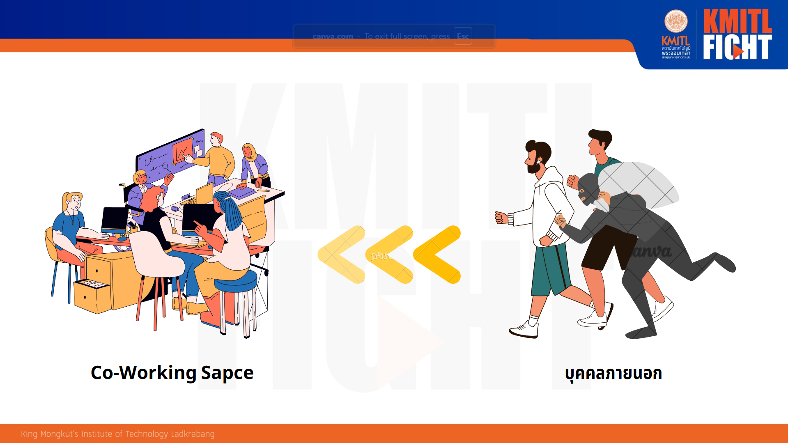
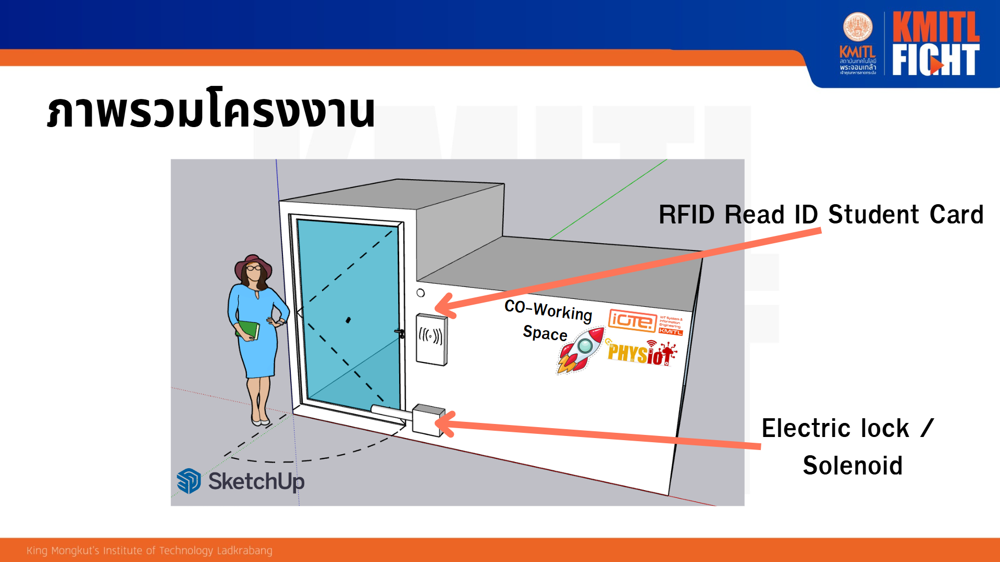

# ✨  ❝ DoorKeeper - กลอนประตูรักษาการอัจฉริยะ ❞ ✨

Semester 1, Academic Year 2024
As part of the project, subject 01236254 Circuit and Electronics and subject 01236255 Introduction to Internet of Things

IoT System and Information Engineering

King Mongkut's Institute of Technology Ladkrabang

## 📁 Table of Contents

  🔸 [Links](#links)  
  🔸 [Credits](#Credits)  
  🔸 [แนวคิดและที่มา](#แนวคิดและที่มา)  
  🔸 [ภาพรวมโครงงาน](#ภาพรวมโครงงาน)  
  🔸 [Block Diagram](#block-diagram)  
  🔸 [ส่วนประกอบ](#ส่วนประกอบ)  
  🔸 [Final Product](#final-product)  
  🔸 [Tech Stack](#tech-stack)  
  🔸 [Languages](#languages)  

## 🌐 Links

- [Dashboard](https://doornot.fakepng.dev/ui)

## 👥 Credits

### Member
- NATTHAWIT NOWANGHAN : Hardware (Device) & Cloud & User Interface
- TECHAWICH  AJJAGLAB : Create a model that can be used to simulate the project
- THANATHON  PINYOMETAKUN : Database & Cloud & User Interface  

กูไม่แปะหน้าหมาป่าเดียวดายหรอก ว่ะ ฮ้า ฮ่า
ลืมอดีตอันดำมืดของพวกเราไปซะ

### ขอขอบคุณผู้ให้คำปรึกษา
- ดร.นัชนัยน์ รุ่งเหมือนฟ้า
- ผศ.สรพงษ์ วชิรรัตนพรกุล
- ธิติ ศรีประสงค์
- กฤษณ์ เกษมเทวินทร์
- อังศุชวาล	สมิตชาติ
- อรรถกร นาราช
- ธีรภัทร	ราชปัก
- ธนาตย์ จอมใจเอกขน
- เสฎฐวุฒิ สวัสดี
  

## ❓ แนวคิดและที่มา

โครงการ DoorKeeper เกิดขึ้นจากความจำเป็นในการเพิ่มความปลอดภัยให้กับพื้นที่ Co-working space โดยเฉพาะในสาขาที่มีปัญหาบุคคลภายนอกสามารถเข้าถึงพื้นที่ได้อย่างอิสระ นอกจากนี้ การควบคุมจำนวนผู้ใช้งานในห้องก็เป็นปัจจัยสำคัญที่ต้องพิจารณา เพื่อป้องกันปัญหาความแออัดและส่งเสริมสภาพแวดล้อมการทำงานที่เหมาะสม ด้วยแนวคิดในการนำเทคโนโลยี IoT มาประยุกต์ใช้ โครงการ DoorKeeper มุ่งเน้นการพัฒนาระบบควบคุมการเข้าออกด้วยบัตรนักศึกษา ซึ่งจะช่วยจำกัดสิทธิ์การเข้าถึงพื้นที่ให้เฉพาะบุคลากรในสาขาเท่านั้น นอกจากนี้ ระบบยังมีฟังก์ชันการนับจำนวนผู้ใช้งานภายในห้องแบบเรียลไทม์ ทำให้ผู้ดูแลระบบสามารถวางแผนการใช้งานพื้นที่ได้อย่างมีประสิทธิภาพมากขึ้น โครงการนี้จึงตอบโจทย์ความต้องการในการสร้างสภาพแวดล้อมการทำงานที่ปลอดภัยและเป็นส่วนตัวสำหรับนักศึกษาและอาจารย์ ช่วยลดความเสี่ยงในการสูญหายของทรัพย์สินและเอกสารสำคัญ อีกทั้งยังช่วยให้ผู้ใช้งานสามารถทำงานได้อย่างมีประสิทธิภาพมากยิ่งขึ้น เนื่องจากมีพื้นที่ทำงานที่เพียงพอและสะดวกสบาย ทำให้เกิดบรรยากาศการทำงานที่ดีและเพิ่มประสิทธิผลโดยรวมในการทำงาน

 

## 🚀 ภาพรวมโครงงาน

 

## ✨ Block Diagram

## 📍 ส่วนประกอบ

|                     รูป                      |            ส่วนประกอบ             |         รายละเอียด         | ราคา (฿) |
| :------------------------------------------: | :-------------------------------: | :------------------------: | -------: |
|  |          ESP8266 DevKit           | บอร์ดควบคุมการทำงานของระบบ |   150.00 |
|           |        RFID Module (rc522)        |     บอร์ดอ่านบัตร RFID     |    55.00 |
|       |           Relay Module            |  บอร์ดรีเลย์ควบคุมกรประตู  |    58.00 |
|   |           Solenoid Lock           |          กรประตู           |   190.00 |
|                 |              Buzzer               |   บอร์ดส่งเสียงแจ้งเตือน   |     9.00 |
|         | DC-DC Step Down (12VDC -> 3.2VDC) |    บอร์ดแปลงกระแสไฟฟ้า     |    30.00 |
|       |  Power Supply (220VAC -> 12VDC)   |    บอร์ดแปลงกระแสไฟฟ้า     |   280.00 |
|                       |                PCB                |       Prototype PCB        |    45.00 |
|                |              Button               |           ปุ่มกด           |     9.00 |
|             |          Screw terminal           |         Connector          |    15.00 |
|             |          Socket AC Power          |      Socket AC Power       |    10.00 |
|      Total (ไม่รวมค่าขนส่งและค่าอื่นๆ)       |                                   |                            |   851.00 |

## Final Product

## Tech Stack

- [VS Code](https://code.visualstudio.com/): IDE
- [PlatformIO](https://platformio.org/): Arduino compiler
- [Node.js](https://nodejs.org/en/): Javascript runtime
- [Express.js](https://expressjs.com/): Web framework for Node.js
- [Typescript](https://www.typescriptlang.org/): Strong type Javascript
- [Prisma](https://www.prisma.io/): Typescript ORM
- [PostgreSQL](https://www.postgresql.org/): Database
- [Node-RED](https://nodered.org/): Flow-based programming for IoT
- [Mosquitto](https://mosquitto.org/): MQTT broker
- [Docker](https://www.docker.com/): Containerization
- [Portainer](https://www.portainer.io/): Docker management
- [Cloudflare](https://www.cloudflare.com/): DNS, CDN, SSL
- [Cloudflare Tunnel](https://www.cloudflare.com/products/tunnel/): Expose local server to the internet
- [Nginx Proxy Manager](https://nginxproxymanager.com/): Reverse proxy
- [Proxmox](https://www.proxmox.com/en/): Hypervisor
- [GitHub](https://github.com): Version control

## Languages

- [Javascript](https://developer.mozilla.org/en-US/docs/Web/JavaScript)
- [Typescript](https://www.typescriptlang.org/)
- [C++](https://en.wikipedia.org/wiki/C%2B%2B)
