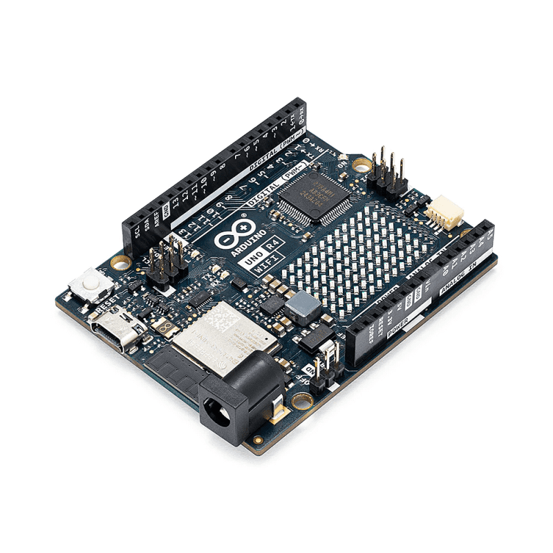
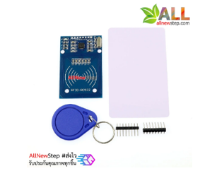
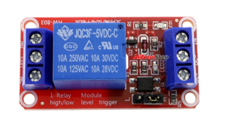
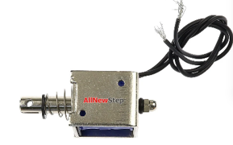
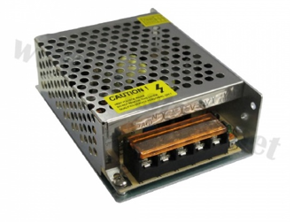
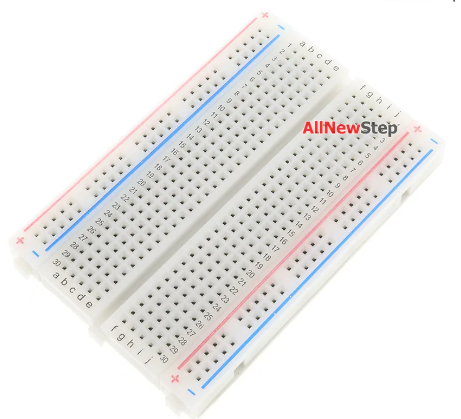
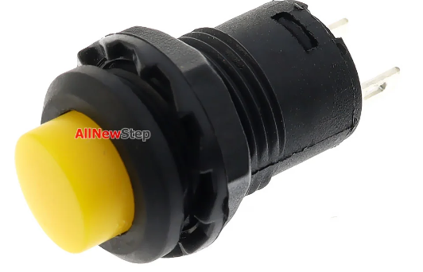
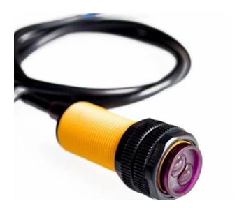
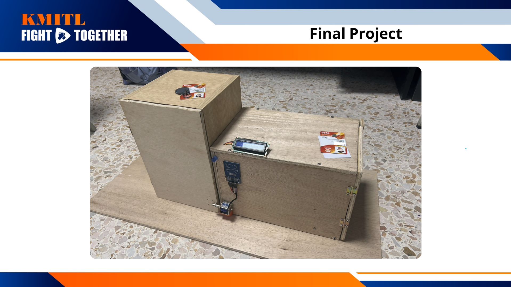

#   ❝ DoorKeeper - กลอนประตูรักษาการอัจฉริยะ ❞ 

## 📍Features
- Monitoring | Count the number of people entering/exiting and display the results via the Dashboard in real time.
- Controlling | Can control the opening and closing remotely via the dashboard.
- Data Storage | Store the name and time of people entering/exiting in Google Sheet.
- Notification | Notify via Line Notify

## 📍 Component

|                     image                    |            Component             |         details         | value (฿) |
| :------------------------------------------: | :-------------------------------: | :------------------------: | -------: |
| |          Arduino UNO R4 WiFi      | System operation control board |   1099.00 |
|           |        RFID Card Reader/Detector Module Kit (RC522) พร้อม Tag Card และ Tag พวงกุญแจ        |     RFID card reader board     |    50.00 |
|       |           Relay 5V 1 Channel Isolation High And Low Trigger relay            |  Door control relay board  |    30.00 |
|   |           JF-0826B 12V กลอนไฟฟ้า กลอนประตูไฟฟ้า JF-0826B แม่เหล็กไฟฟ้าโซลินอยด์แม่เหล็กไฟฟ้า          |          Electric door lock          |   120.00 |
|                 |              Buzzer               |  The board sends a notification sound.    |     5.00 |
|       |  Power Supply (220VAC -> 12VDC)   |    Power converter board     |   280.00 |
|                       |                Breadboard                |       บอร์ดทดลอง Breadboard 400 holes       |    24.00 |
|                |              Button               |           reset round button switch           |     7.00 |
|             |          E18-D80NK Photoelectric Sensor Infrared Reflectance Proximity Sensor for Arduino           |         Count the number of people          |    85.00 |
|      Total (excluding shipping and other costs)       |                                   |                            |   1700.00 (Baht) |

## ❓ Concept and origin

The DoorKeeper project was initiated out of the necessity to enhance the security of co-working spaces, particularly in branches where external individuals could freely access the area. Additionally, controlling the number of users in the room was a key factor to consider, in order to prevent overcrowding and promote a suitable working environment. With the idea of applying IoT technology, the DoorKeeper project focuses on developing an access control system using student ID cards, which helps restrict access to the area exclusively to staff members of the branch. Furthermore, the system includes a real-time room occupancy tracking feature, enabling administrators to plan space utilization more efficiently.

This project addresses the need for creating a secure and private working environment for students and faculty members, reducing the risk of theft or loss of important documents and assets. It also enhances the user experience by ensuring that there is adequate and comfortable workspace, fostering a positive work atmosphere and ultimately improving overall productivity.

 

## 🌈 Project Overview

 

## ✨ Block Diagram

 

## 🤩 Final Project

 

## 📍 Platform and dependencies
The source code was written on PlatformIO IDE with Arduino framework.

Library used:
- [PubSubClient](https://github.com/knolleary/pubsubclient)

## 👥 Credits

### Member
- NATTHAWIT N. : Hardware (Device) & Cloud & User Interface
- TECHAWICH  AJJAGLAB : Create a model that can be used to simulate the project
- THANATHON  PINYOMETAKUN : Database & Cloud & User Interface  

### Thank you to the advisors (ขอขอบคุณผู้ให้คำปรึกษา)
- ดร.นัชนัยน์ รุ่งเหมือนฟ้า
- ผศ.สรพงษ์ วชิรรัตนพรกุล
- ธิติ ศรีประสงค์
- กฤษณ์ เกษมเทวินทร์
- อังศุชวาล	สมิตชาติ
- อรรถกร นาราช
- ธีรภัทร	ราชปัก
- ธนาตย์ จอมใจเอกขน
- เสฎฐวุฒิ สวัสดี
  
## 🚀 Future Goals

#### Face Recognition Integration:
Integrate a camera module with face recognition software (such as OpenCV) to add an additional layer of security. This could help confirm identity beyond just the RFID scan, improving security for sensitive areas.

#### Hall magnetic Sensor Module:
Currently we are using delay to command the electric lock to lock, in the future we will develop using magnetic sensor.

